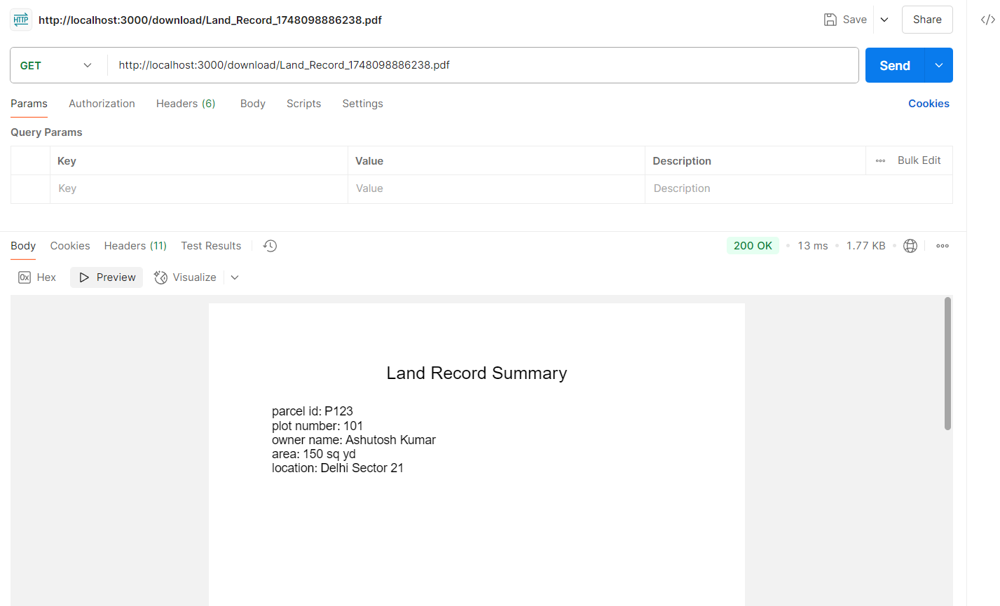

# Land Record Search API

A simple Node.js API to search land records and download a PDF summary.

## Tech Stack
- Node.js + Express
- MySQL
- PDFKit

## Setup Instructions

1. **Clone the repo**  
   git clone [<your_repo_link>](https://github.com/Ashutosh-kumar-code/Search-Land-Records.git)
   cd <project_folder>

## Install Dependencies & Start the Server

npm install
node server.js

Then in phpmyadmin I create the new database with name "landeep",
then when code run then it already set a demo data to this database, and then you will able to run the below api.

## API Usage
POST api  ( http://localhost:3000/search )
In body -> raw -> JSON
**give this :- 
{
  "input": "Ashutosh Kumar"
}

**Response like:- 
    {
  "message": "PDF generated successfully.",
  "downloadUrl": "http://localhost:3000/download/Land_Record_1716532717003.pdf"
    }

## Sample Output of Pdf
The generated PDF will include: ( its in pdfs folder )

" Land Record Summary

Parcel ID: P123  
Plot Number: 101  
Owner Name: Ashutosh Kumar  
Area: 150 sq yd  
Location: Delhi Sector 2 "